{fig-align="left"}

# ¿A quien va dirigido?

La presente guía tiene como objetivo presentar un flujo de trabajo para la generación de reportes universitarios, literarios, científicos y más de alta calidad, bajo la modalidad colaborativa en la nube utilizando la plataforma web **Overleaf** y el administrador de referencias **Zotero**. Esta guía es útil para nuevos usuarios que desean comenzar en el mundo de \LaTeX{} o buscan una alternativa práctica y open-source a editores de texto comerciales. Siendo su principal ventaja, centrarse menos en la *forma* del documento y más en el *fondo* del mismo. Pero sobre todo, para todos aquellos estudiantes y profesionales que prefieren aprender lo básico en idioma español.

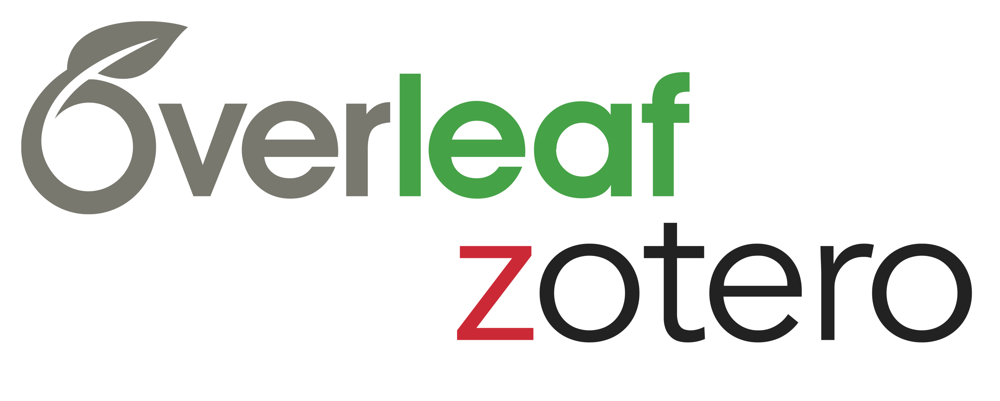{fig-align="center" width="500"}

# Gestor de Referencias

En esta oportunidad, se recomienda el uso de [Zotero](https://www.zotero.org) {width="20"} por la evidente ventaja y flexibilidad sobre otros programas en el mercado gracias a la gran cantidad de [plugins](https://www.zotero.org/support/plugins) o extensiones que mejoran, simplifican y enlazan el manejo de referencias bibliográficas, tanto para editar libros, páginas web, blogs, etc.

1.  Crearse una cuenta de forma gratuita en su página oficial.

2.  Descargar el programa e instalar según tu sistema operativo de preferencia. La pantalla principal se verá así.

    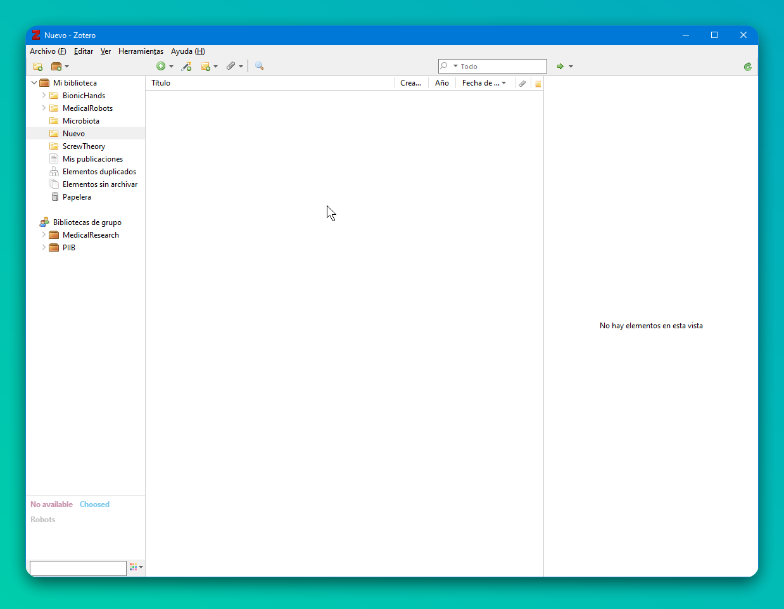{alt="Ventana principal de Zotero." fig-align="center" width="730"}

3.  Descargar e instalar el plugin `Zotero Better Bibtex` [más reciente](https://retorque.re/zotero-better-bibtex/) (desde Github) para el control y creación de etiquetas automáticas (identificador que deberás escribir para especificar una referencia particular) para citar de forma fácil y ordenada durante la redacción de documentos.

    i.  Ir a la pestaña de **Herramientas**, luego a **Complementos** que abrirá una nueva ventana.

        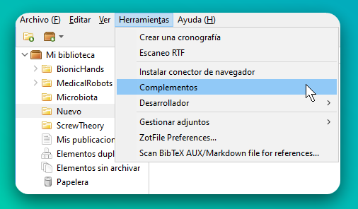{alt="Complementos." fig-align="center" width="550"}

    ii. Ir a **Configuración** ⚙️ y escoger instalar desde un archivo (*install Add-on From File*). Buscar y seleccionar el archivo previamente descargado (por ejemplo `zotero-better-bibtex-6.7.1.xpi`). Reiniciar el programa.

        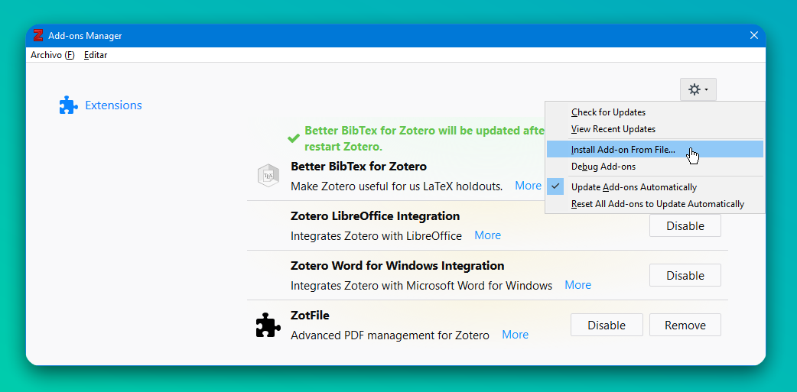{alt="Plugin Zotero Bibtex." fig-align="center" width="550"}

    iii. Repetir el paso 1 y el plugin ahora debe aparecer instalado así.

         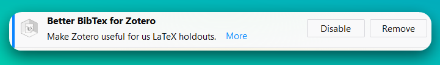{alt="Plugin instalado." fig-align="center" width="500"}

    iv. Ahora lo más importante es modificar la configuración por defecto de las etiquetas de citación (*citation key*). Término que tal vez te resulte familiar si tienes experiencia con \LaTeX, Markdown, Rmarkdown o Quarto. En cualquier caso, una etiqueta es la palabra clave por el que identificarás una fuente específica a la hora de relacionar y crear una cita para algún documento científico, libro, página web, etc. Dependiendo del formato de etiqueta que desees por comodidad, el parámetro a modificar será diferente. Por conveniencia, se utiliza el formato APA compuesto por el primer apellido del autor principal y el año de publicación[^1].

    v.  Ir a la pestaña **Editar** y luego a **Preferencias** que abrirá una nueva ventana. Ir a la opción **Better BibTex** y a la subpestaña **Citation keys**.

        > En el espacio *New citation key format* modificar a `auth.capitalize+year` .

        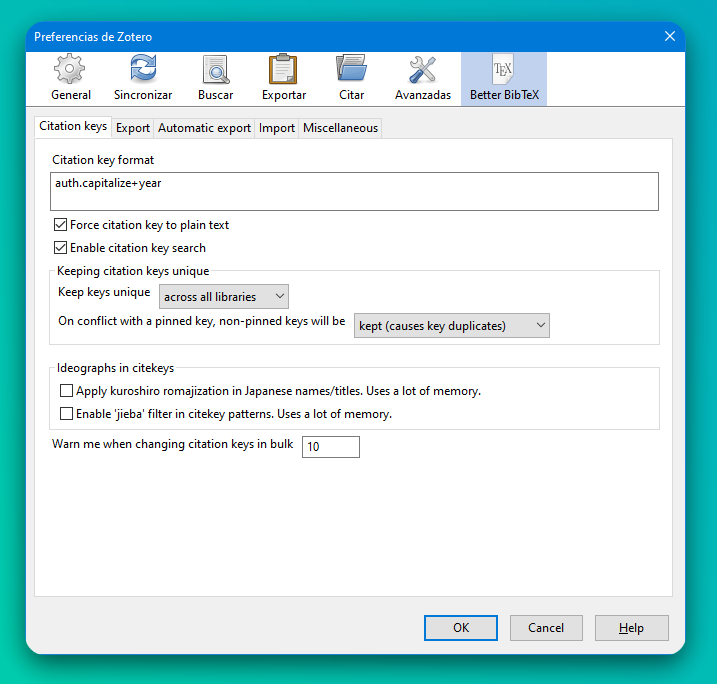{alt="Formato de etiquetas." fig-align="center" width="520"}

    vi. En este punto, cualquier archivo nuevo que se agregue a tu biblioteca, estará asociado a una etiqueta reconocible para su fácil manejo y memorización a la hora de buscar alguna cita. En caso de repetirse citas, el plugin tiene la capacidad de diferenciarlos por letras al final de la etiqueta según su antiguedad, por ejemplo, Cryan2019a, Cryan2019b, etc.

        {alt="Etiquetas." fig-align="center" width="310"}

4.  Armar tu biblioteca Zotero

    Antes de explicar como agregar nuevas fuentes, es necesario saber dos aspectos importantes:

    -   Tu biblioteca puede organizarse como cualquier organizador de archivos: Carpetas y subcarpetas 📁.

    -   Existen dos bibliotecas principales: **Mi biblioteca** y **Bibliotecas de grupo.** La primera es para tu manejo personal y los documentos agregados solo podrán ser manipulados por ti. Por el contrario, los de tipo grupal pueden compartirse con otros usuarios de Zotero, incluso con privilegios de modificación (agregar notas 📔, adjuntar archivos 🔗, comentar 📝, etc.). En pocas palabras, investigación colaborativa 🧑‍🤝‍🧑.

    a.  Desde la aplicación de escritorio 🖥️

        A.  Método 1 (**El mejor método 😃**): La forma más elegante es buscar los códigos de la publicación como DOI, ISBN, PMID, arXiv, etc. En el caso de artículos científicos, el código está casi siempre en la página de publicación. Solo basta con copiar, pegar, presionar enter y voilà : Toda la información ha sido agregado. Si tienes suerte (o mejor dicho si la publicación es *open-access*), el archivo pdf aparecerá como adjunto {width="20"}. Sino adjuntarlo de forma manual `click derecho a tu cita agregada -> Añadir adjunto ->  Añadir copia guardada`.

            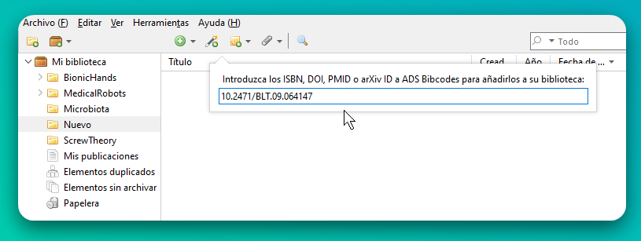{fig-align="center" width="560"}

            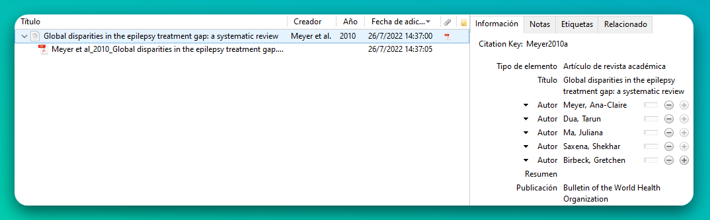{fig-align="center" width="750"}

            {fig-align="center" width="750"}

        B.  Método 2 (**Cuando no tienes opción 😑**): El ingreso se realiza de forma manual y según el tipo de fuente bibliográfica (revista, libro, etc.), los datos requeridos pueden variar (**al menos un autor y el título son necesarios**).

    b.  Desde tu navegador de búsqueda 🌐

        La magia de utilizar una extensión (*add-on)* desde tu navegador favorito, es que [Zotero Connector](https://www.zotero.org/download/) permite guardar la información de la página web con un solo click (utilizando metadata) a tu biblioteca.

        {fig-align="center" width="750"}

[^1]: Las etiquetas usadas por Zotero se utilizan únicamente para crear el enlace y llamar la cita requerida durante la redacción de documentos. No confundir con el estilo visual de las citas que se aprecian en el documento final. El formato de las etiquetas es para un uso interno y de ayuda memotécnica, ordenada y sencilla a la hora de buscar un autor particular dentro de toda una biblioteca.

::: callout-important
Para un guardado correcto de los datos, utilizar la extensión desde la página oficial o repositorio de preferencia del artículo científico. Por ejemplo, SAGE, IEEE, Scielo, etc.
:::

::: callout-tip
Manteniendo la carpeta de interés seleccionada desde la aplicación de Zotero mientras se activa la extensión en el navegador, el nuevo documento es automáticamente guardado en dicha carpeta. Caso contrario, se selecciona la ubicación desde la misma extensión.
:::

::: callout-caution
En las nuevas versiones de Zotero, las etiquetas de citación ("Citation key") pueden permanecer fijas en todo momento y no seguir la regla por defecto o definida en el punto 3. Esto puede ocurrir quizas por el cambio en el siguiente parámetro: `0 seconds`
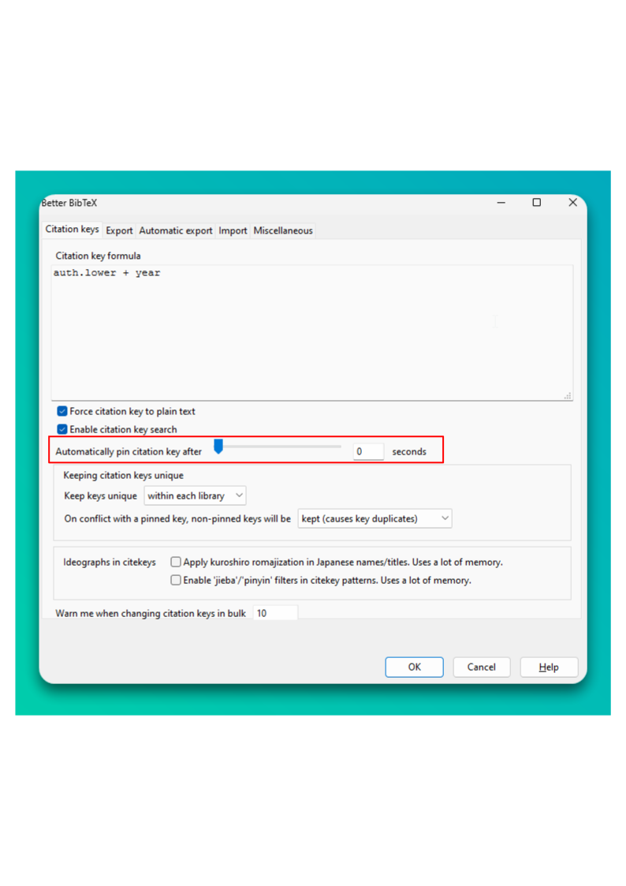{fig-align="center" width="650"}
:::

## Exportación de las referencias

Zotero ofrece la ventaja de exportar las referencias en diferentes formatos, debidamente estructurados en un simple paso. Para su uso con Overleaf, es necesario el uso de ficheros `.bib` compatibles con \LaTeX. El plugin **Better Bibtex** ayuda justamente en la correcta exportación de las referencias, sobre todo, a la hora de manejar las tildes y diéresis en el nombre de los autores y títulos en el idioma español.

-   **Método 1**: Selección parcial. Seleccionar los elementos deseados, click derecho y **Exportar elementos**.

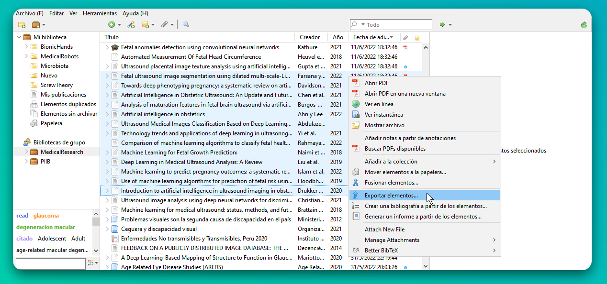{fig-align="center" width="750"}

-   **Método 2**: Selección de una carpeta completa. Dirigirse al panel izquierdo y seleccionar la carpeta de interés (por ejemplo ScrewTheory). Todos los elementos dentro de ella serán exportados.

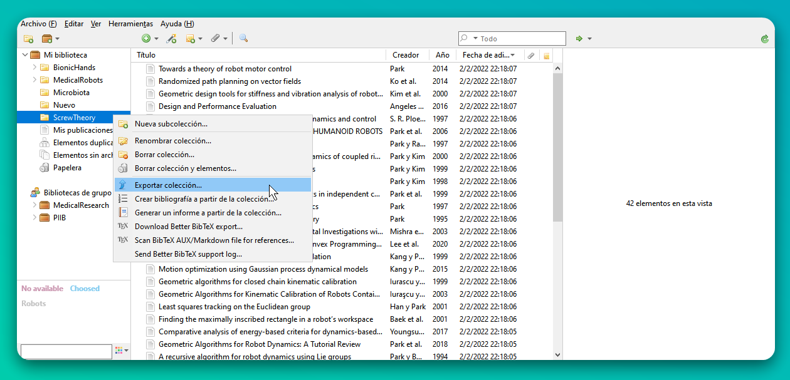{fig-align="center" width="750"}

Finalmente, una ventana con algunos ajustes pueden seleccionarse si es necesario. Por recomendación, dejar sin marcar todas las opciones, y dar **OK**. Un archivo `.bib` será creado.

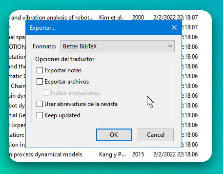{fig-align="center" width="350"}

# Entorno colaborativo para creación de documentos

Si bien existen múltiples editores o aplicaciones web de moda para escribir documentos de forma colaborativa en tiempo real como [GoogleDocs](https://docs.google.com/), [Microsoft Office 365](https://www.office.com/), [Jupyter](https://jupyter.org), la mayoría de ellos siguen el estilo de redacción *"What you see, what you get"* , que en otras palabras, la configuración y personalización de los estilos de texto se realizan mediante la interfaz del programa al presionar botones (por ejemplo, la clásica justificación de texto en Microsoft Word que todos hemos realizado alguna vez). Sin embargo, existen otros editores que utilizan código plano mediante instrucciones específicas (algunas palabras claves que hay que memorizarse 😢) que pueden realizar lo mismo o incluso, mayor personalización.

Tal es el caso de los editores que trabajan como entornos \LaTeX{} para la preparación de artículos científicos. Si bien su uso desde una aplicación de escritorio implica la instalación de algunos programas, editores y paquetes desde un [super repositorio](https://www.ctan.org/), en esta oportunidad, se recomienda el uso de editores _online_ que se encargan de todo ese trabajo aburrido y concentrarte principalmente en escribir {width="20"}, que es para lo que estamos aquí. Así, la mejor opción que te recomiendo es comenzar con **Overleaf**, ya que cuenta con más de 15 000 plantillas, desde como hacer un currículum vitae profesional hasta utilizar los formatos de publicación de las revistas indexadas más conocidas. En cualquier caso, la creación de una nueva plantilla establece la configuración mínima reproducible para generar tu documento en formato pdf (curiosamente es el único formato que puede exportarse pero el más utilizado para compartir en la nube ☁️😂☁️).

a.  Crearse una cuenta desde la [página oficial](https://www.overleaf.com/). Por recomendación, utilizar el mismo correo electrónico de su cuenta Zotero.

    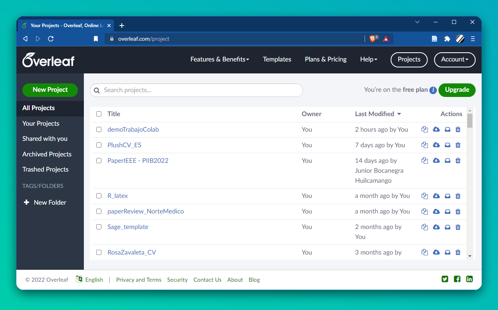{fig-align="center" width="750"}

b.  Escoger alguna plantilla para comenzar a escribir. Una vez seleccionada, se abrirá el entorno de edición. Para seleccionar otra plantilla, ir a `Templates` o si prefieres escoger alguno otro previamente creado, ir a `Projects` o presionar {width="20"}.

    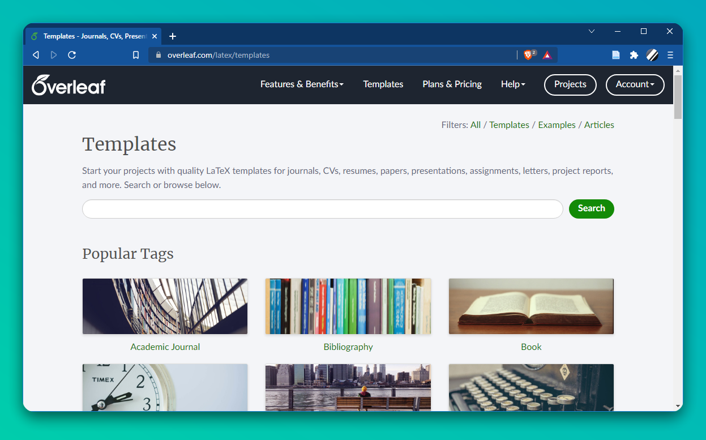{fig-align="center" width="750"}

c.  El editor se compone de cuatro paneles principales según:

    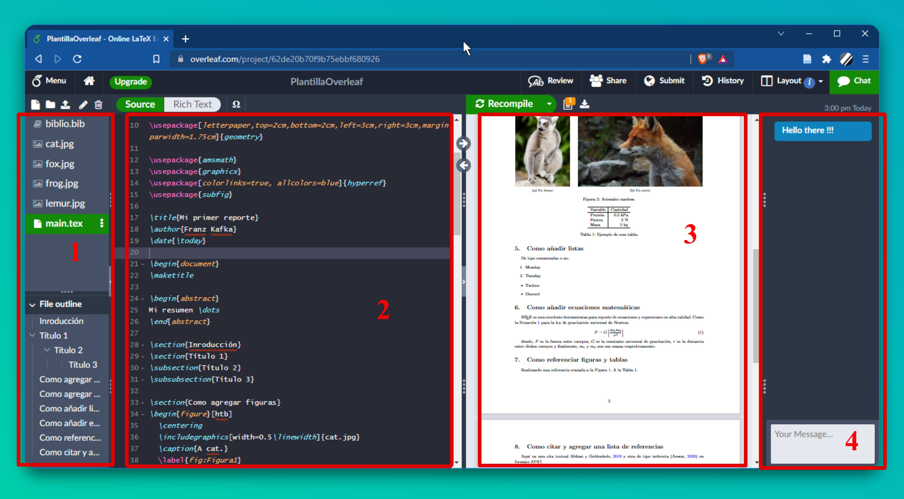{fig-align="center" width="750"}

    Donde,

    (1) **El administrador de archivos.** Contiene distintos ficheros para la creación del documento, como el fichero base (.tex), los distintos estilos de la plantilla si existen (`.cls`, ⚠️ no modificar a menos que tengas conocimiento previo), el archivo de referencias (`.bib`), figuras, etc.

    (2) **El editor de documentos**. Todo el texto deseado se escribe dentro de los límites definidos por las sentencias `\begin{document} … \end{document}`.

    (3) **Salida del documento.** El documento es creado por la compilación del código y su exportación en formato pdf, al presionar el botón superior derecho **Recompile**.

    (4) **Chat.** Para la comunicación entre colaboradores.

## Subir archivos al "proyecto"

Desde el botón {width="20"} puedes acceder a una nueva ventana para la importación de archivos dese tu almacenamiento local o externos, incluido otras bibliotecas como Mendeley y Zotero. Sin embargo, estas modalidades enlazan toda tu biblioteca (todas las carpetas y subcarpetas personales o compartidas) y por lo tanto, el archivo `.bib` contendrá todo estas referencias. Siendo su principal ventaja, una actualización automática sin necesidad de exportar las referencias desde Zotero y subir al proyecto de Overleaf.

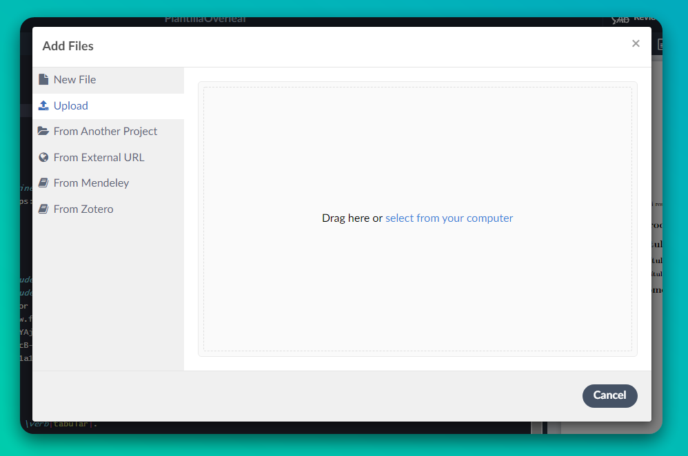{fig-align="center" width="550"}

## Compartir plantilla

Para trabajar de forma conjunta y redactar el reporte en tiempo real, basta con activar la opción de compartir la plantilla desde el bóton **Share** {width="20"} para invitar a otros usuarios de Overleaf (necesario) con permisos de visualización o modificación según prefieras.

-   La ventana que se abre tiene por defecto la opción de *compartido general* apagado y puede activarse desde la opción *Turn on link sharing*. Solo colaboradores invitados por correo electrónico podrán acceder al proyecto en Overleaf según los permisos otorgados.

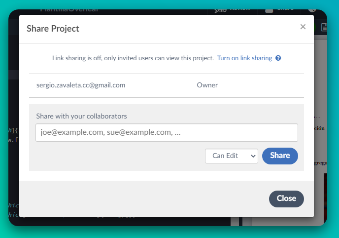{fig-align="center" width="500"}

-   Caso contrario, puede compartirse como cualquier archivo en la nube mediante dos tipos de enlace para visualización o edición.

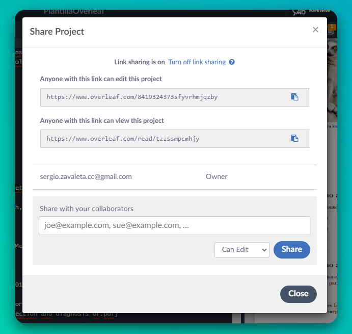{fig-align="center" width="550"}

## Manejo de referencias `.bib`

-   Por defecto, la mayoría de plantillas utilizan el siguiente código, donde el archivo de referencias `.bib` es indicado dentro de `\bibliography{}`. Y el estilo de citas y bibliografía dentro de `\bibliographystyle{}`.

    ``` latex
    % Área de encabezados y modificación de plantilla
    \begin{document}
    % Inicio de reporte
    % Fin de reporte
    \bibliographystyle{apalike}
    \bibliography{biblio.bib}
    \end{document}    
    ```

-   De forma alterna, el archivo de referencias `.bib` puede también indicarse dentro de `\addbibresource{}`. Y el estilo de citas y bibliografías dentro de `\usepackage{style=apa}{biblatex}`.

    ``` latex
    % Área de encabezados y modificación de plantilla
    \usepackage[backend=biber,style=apa,sortcites=true,natbib=true, url=true]{biblatex}
    \DeclareLanguageMapping{spanish}{spanish-apa}
    \addbibresource{biblio.bib}

    \begin{document}
    % Inicio de reporte
    % Fin de reporte
    \printbibliography[heading=bibintoc, title={Referencias Bibliográficas}]
    \end{document}  
    ```

Las referencias exportadas por Zotero (`biblio.bib`) pueden modificarse según sea necesario. Nótese los elementos de dos artículos de tipo @article con sus etiquetas `Abbasi2019` y `Acharya2018` respectivamente.

{fig-align="center" width="700"}

\newpage

## Sentencias \LaTeX{} necesarias

+---------------------------------------------------------------+---------------------------------------------+
| Código                                                        | Salida                                      |
+:==============================================================+:===========================================:+
| ``` latex                                                     | 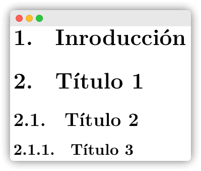{width="190"}      |
| \section{Título 1}                                            |                                             |
| \subsection{Título 2}                                         |                                             |
| \subsubsection{Título 3}                                      |                                             |
| \subsubsection{Título 4}                                      |                                             |
| ```                                                           |                                             |
+---------------------------------------------------------------+---------------------------------------------+
| ``` latex                                                     | {width="240"} |
| \begin{figure}                                                |                                             |
|   \centering                                                  |                                             |
|   \includegraphics[width="valor"]{cat.jpg}                    |                                             |
|   \caption{A cat.}                                            |                                             |
|   \label{fig:etiqueta1}                                       |                                             |
| \end{figure}                                                  |                                             |
| ```                                                           |                                             |
|                                                               |                                             |
| Donde "valor" puede ser:                                      |                                             |
|                                                               |                                             |
| > -   Ancho máximo de la hoja para escribir: \\textwidth.     |                                             |
| >                                                             |                                             |
| > -   Ancho máximo de una columna: \\linewidth.               |                                             |
| >                                                             |                                             |
| > -   Ancho por unidades métricas: 2cm, 20mm, 40em, 1in.      |                                             |
+---------------------------------------------------------------+---------------------------------------------+

::: callout-tip
Para leer más sobre \\linewdith y \\textwidth y sus diferencias, revisar [aquí](https://tex.stackexchange.com/questions/16942/difference-between-textwidth-linewidth-and-hsize).
:::

``` latex
\documentclass{article}
\usepackage{subfig}
\begin{document}
\begin{figure}
  \centering
  \subfloat[Un lemur.]{\includegraphics[width=0.4\linewidth]{lemur.jpg}}
  \subfloat[Un lobo.]{\includegraphics[width=0.4\linewidth]{fox.jpg}}
  \caption{Animales random.}
  \label{fig:etiqueta2}
\end{figure}
\end{document}
```

\newpage
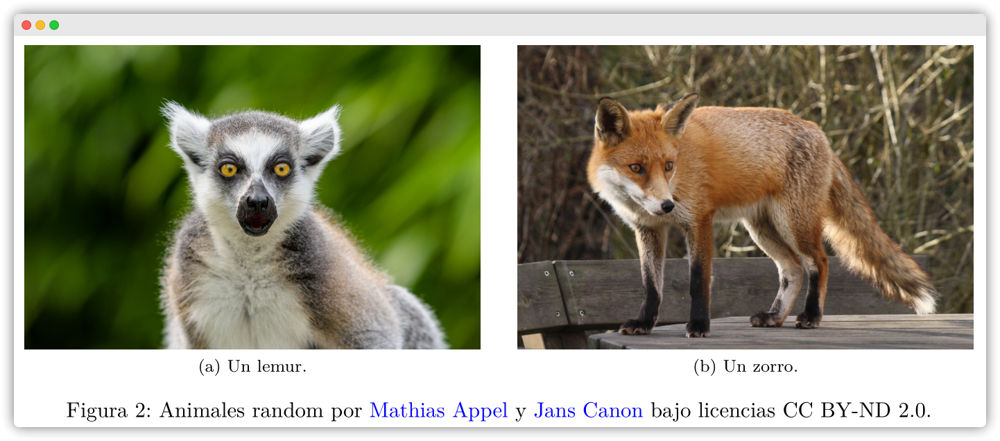{fig-align="center" width="633"}

+---------------------------------+:-------------------------------------:+
| ``` latex                       | 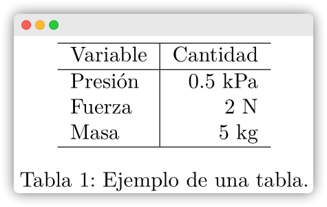{width="234"} |
| \begin{table}                   |                                       |
| \centering                      |                                       |
| \begin{tabular}{l|r}            |                                       |
|   \hline                        |                                       |
|   Variable & Cantidad \\        |                                       |
|   \hline                        |                                       |
|   Presión & 0.5 kPa \\          |                                       |
|   Fuerza & 2 N \\               |                                       |
|   Masa & 5 kg\\                 |                                       |
|   \hline                        |                                       |
| \end{tabular}                   |                                       |
| \caption{Ejemplo de una tabla.} |                                       |
| \label{tab:Tabla1}              |                                       |
| \end{table}                     |                                       |
| ```                             |                                       |
+---------------------------------+---------------------------------------+

``` latex
\begin{equation}
  F = G\left[{\frac{{{m_1}{m_2}}}{{{r^2}}}}\right]
  \label{eq:Eq1}
\end{equation}
```

$$F = G\left[ {\frac{{{m_1}{m_2}}}{{{r^2}}}} \right]$$

::: callout-tip
Para crear las ecuaciones de forma rápida y fácil se recomienda el uso páginas web gratis para escribir de forma gráfica (símbolos, texto, etc.) como [latex.codecogs](https://latex.codecogs.com/eqneditor/editor.php), [latexeditor](https://latexeditor.lagrida.com/), [latex4technics](https://www.latex4technics.com/) y más; o en forma _offline_, con programas como [MathType](https://www.wiris.com/en/mathtype/) para insertar el código \LaTeX{} directamente entre los entornos de ecuaciones `\begin{equation} … \end{equation}` o a nivel del texto usando `$ … $` o `\( … \)`. Por ejemplo, esta ecuación de aquí $\sum a^{i} + \epsilon$ se escribe como `$\sum a^{i} + \epsilon$`. 

Mayor información acerca de los entornos de ecuaciones, símbolos matemáticos ($\alpha, \gamma, \pm$, etc.) y sus ejemplos pueden encontrarse en esta corta pero útil [guía](http://tug.ctan.org/info/short-math-guide/short-math-guide.pdf) (en inglés).
:::

+-------------------+:-------------------------------------:+
| ``` latex         | 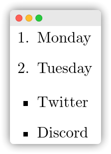{width="125"} |
| \begin{enumerate} |                                       |
|     \item Monday  |                                       |
|     \item Tuesday |                                       |
| \end{enumerate}   |                                       |
|                   |                                       |
| \begin{itemize}   |                                       |
|     \item Twitter |                                       |
|     \item Discord |                                       |
| \end{itemize}     |                                       |
| ```               |                                       |
+-------------------+---------------------------------------+

``` latex
\section{Como referenciar una figura, una tabla y citar}
Realizando una referencia cruzada a la Figura \ref{fig:Figura1}. A la Tabla \ref{tab:Tabla1}.
```

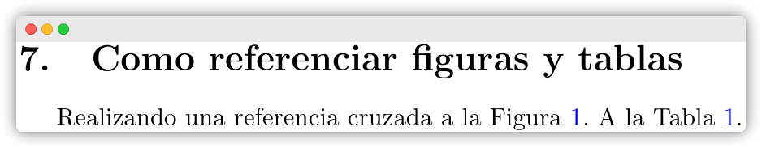{fig-align="center" width="465"}

``` latex
\section{Como citar y agregar una lista de referencias}
Aquí va una cita textual \cite{Abbasi2019} y otra de tipo indirecta \citep{Anwar2020} en formato APA7.

\printbibliography[heading=bibintoc, title={Referencias Bibliográficas}]
```

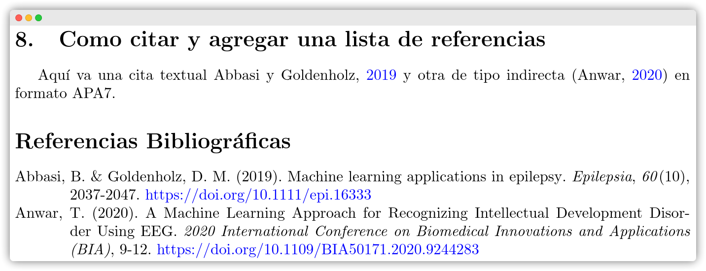{fig-align="center" width="653"}

::: callout-tip
## Más allá de esta guía

Overleaf ofrece las herramientas básicas para un trabajo colaborativo en la nube, con las ventajas de crear reportes de alta calidad en \LaTeX{} de forma sencilla, sin tener que preocuparte por su instalación y actualización de paquetes (códigos específicos para modificar el formato como figuras, colores, formas geométricas, encabezados, bloques de código de programación, anexos, tablas, etc.), y aumentar la productividad de tu escritura. Y que junto al gestor de referencias de Zotero, puede obtenerse un fácil guardado, modificación y exportación de referencias bibliográficas correctamente formateadas para su trabajo desde Overleaf o con cualquier otro editor \LaTeX{} disponible.
:::
