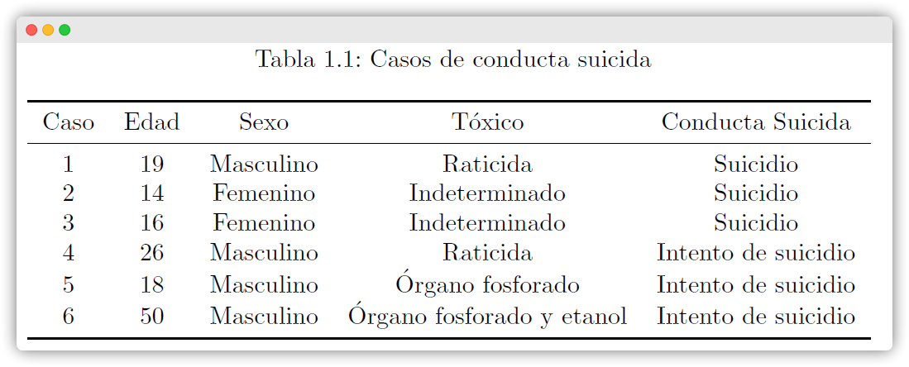
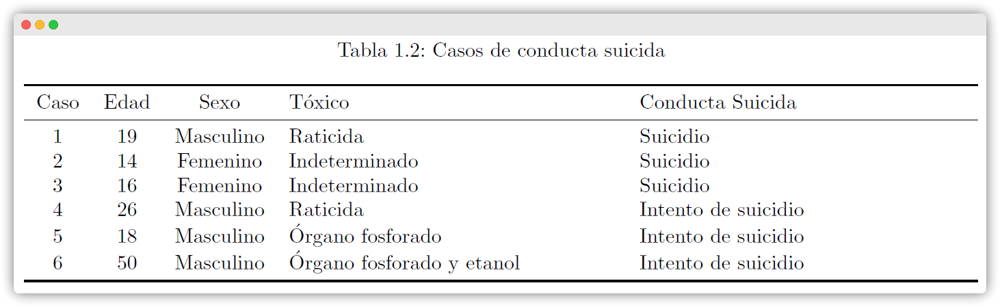
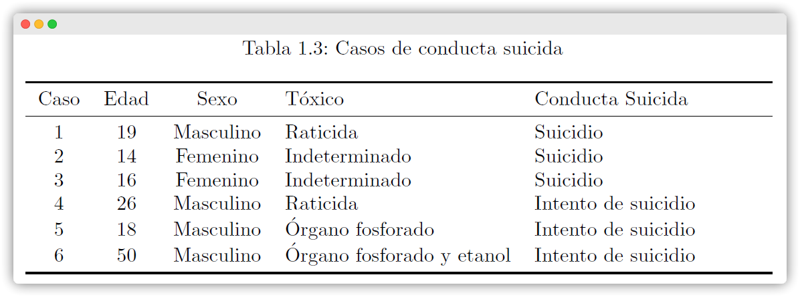
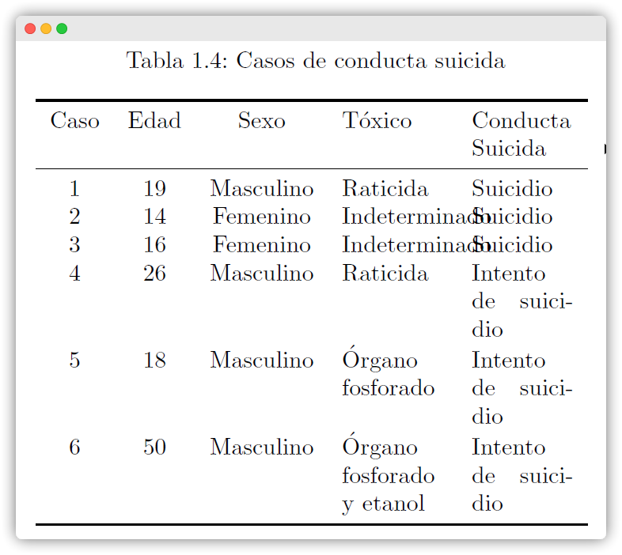
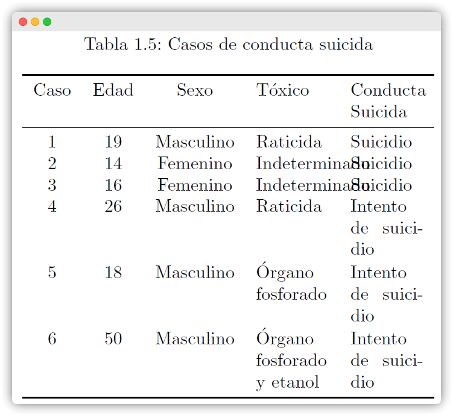
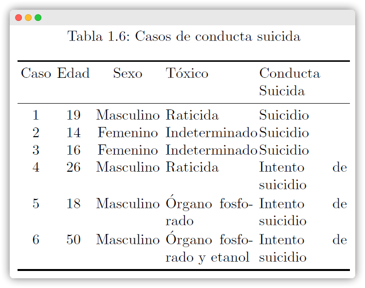
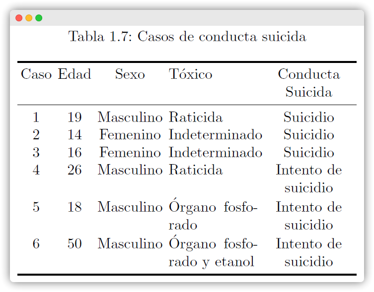
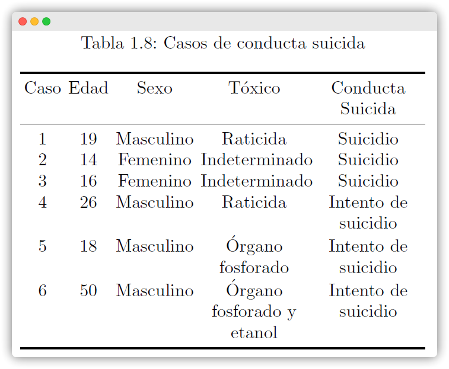
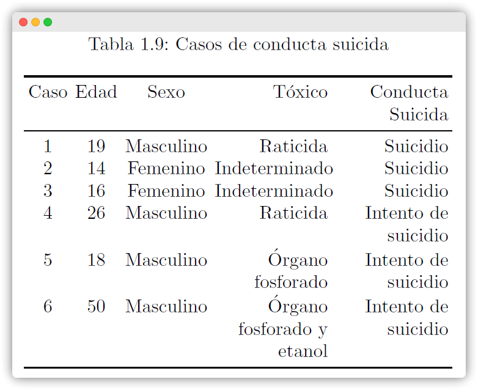
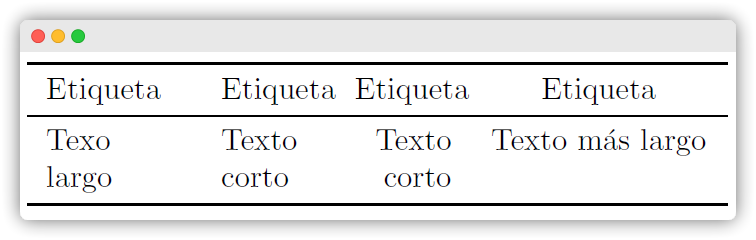

{fig-align="left"}

```{r setup, include=FALSE}
knitr::opts_chunk$set(echo = FALSE)
```

# Modificar el tamaño de tablas

Muchas veces el contenido de una tabla sobrepasa los límites de la hoja como el ancho del formato utilizado en una o dos columnas. Para ello, existen múltiples maneras de adaptar el extenso contenido de una celda en múltiples lineas utilizando el entorno básico `\begin{tabular}...\end{tabular}`. Sin embargo, resulta tedioso realizar el mismo tratamiento para cada tabla y ni que decir en diversos archivos. Así que una solución práctica es dejar que $\LaTeX$ calcule el ancho de las columnas de forma automática y se ajuste al contenido deseado, definiendo el tipo de alineación de las columnas y ancho máximo de la tabla. Para ello, se recomienda el uso del entorno `\begin{tabularx}…\end{tabularx}` luego de cargar el paquete `\usepackage{tabularx}` en el encabezado del archivo `.tex`.

Pero antes de presentar los ejemplos, es necesario mostrar las diferencias entre la terminología utilizada por $\LaTeX$ para determinar la longitud de una línea de texto (`\textwidth`) y columna (`\linwidth`) cuando se utiliza una configuración en una o dos columnas, incluido en un entorno de lista.

## Dimensiones en $\LaTeX$

1.  `\textwidth` es el ancho constante del bloque total de texto.
2.  `\linewidth` es el ancho actual de la línea de texto dentro de una columna.
3.  `\hsize` es el ancho de la actual línea antes de saltar a la siguiente línea.
4.  `\columnwidth` es el ancho de una sola columna de texto (que coincide a `\textwidth` en un documento de una sola columna).

### En una columna

{fig-align="center"}

### En dos columnas

{fig-align="center"}

## Ajustando al ancho de la hoja
Utilizando el entorno de tablas por defecto `\begin{tabular}...\end{tabular}`, el resultado es el siguiente
```{r , out.width = '100%'}
#| label: fig-tabla0
#| fig-cap: "Caso por defecto"

```

En un formato de una sola columna, el ancho de la tabla anterior puede modificarse utilizando el paquete en las Tablas @fig-tabla1, @fig-tabla2 y @fig-tabla3.

1.  Al ancho total de una línea de texto.
2.  A la mitad de la ancho de una línea de texto.
3.  Cuidado!!! Disminuir demasiado el ancho puede superponerse el contenido de las celdas en la tabla.

```{r , out.width = '100%'}
#| label: fig-tabla1
#| fig-cap: "Caso 1"

```

{#fig-tabla2}

```{r , out.width = '100%'}
#| label: fig-tabla3
#| fig-cap: "Caso 3"

```

En un formato de dos columnas, el ancho de la tabla riginal pueden modificarse en las Tablas 1.5, 1.6, 1.7, 1.8, 1.9 y 1.10 en las @fig-tabla4, @fig-tabla5, @fig-tabla6, @fig-tabla7, @fig-tabla8 y @fig-tabla9 respectivamente.

1. Al ancho total de una línea de texto.
2. A la mitad de la ancho de una línea de texto.
3, Cuidado!!! Disminuir demasiado el ancho puede superponerse el contenido de las celdas en la tabla.
4. ..
5. ..
6. ..


```{r , out.width = '100%'}
#| label: fig-tabla4
#| fig-cap: "Caso 1"

```

```{r , out.width = '100%'}
#| label: fig-tabla5
#| fig-cap: "Caso 2"

```

```{r , out.width = '100%'}
#| label: fig-tabla6
#| fig-cap: "Caso 3"

```

```{r , out.width = '100%'}
#| label: fig-tabla7
#| fig-cap: "Caso 4"

```

```{r , out.width = '100%'}
#| label: fig-tabla8
#| fig-cap: "Caso 5"

```

```{r , out.width = '100%'}
#| label: fig-tabla9
#| fig-cap: "Caso 6"

```


<!-- ::: {#fig-elephant} -->

<!-- <iframe width="560" height="315" src="https://www.youtube.com/embed/SNggmeilXDQ"></iframe> -->

<!-- Elephant -->
<!-- ::: -->