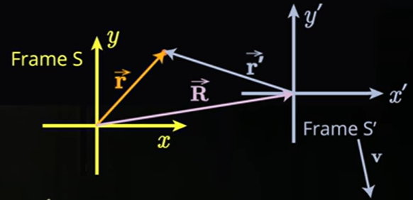
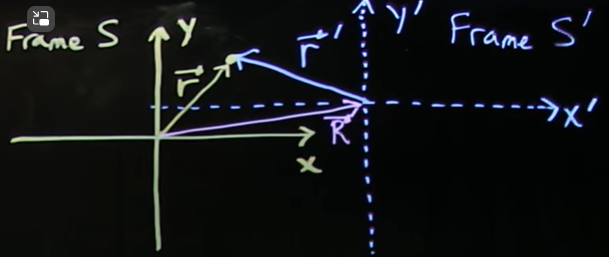

# Sistemas de Referencia (Reference Frames)

{fig-align="center"}

Notar que:

-   Sistema de referencia normalmente se abrevia como "*frame*".

## Sistema de Referencia Inercial (Inertial Reference Frame)

$$
\begin{aligned}
\bar{r}=\bar{R}+{\bar{r}}^{'}\\
\bar{r}^{'}=\bar{r}-{\bar{R}}\\
\end{aligned}
$$

Pero $\bar{V}$ es una constante.

$$
\begin{aligned}
\bar{R}(t)=\bar{R_0}-{\bar{V}t}\\
\frac{d\bar{r}^{'}}{dt} = \frac{d\bar{r}}{dt} - \frac{d\bar{R}}{dt}\\
\bar{v}^{'}=\bar{v}-{\bar{V}}\\
\frac{d\bar{v}^{'}}{dt} = \frac{d\bar{v}}{dt} - \frac{d\bar{V}}{dt}\\
\bar{a}^{'} = \bar{a}
\end{aligned}
$$

Luego, aplicando la primera Ley de Newton se cumple que:

$$
\begin{aligned}
\bar{F} & = m\bar{a}\\
\bar{F}^{'} & = m\bar{a}^{'} = m\bar{a}\\
\end{aligned}
$$

## Sistema de Referencia no Inercial (Non-Inertial Reference Frame)

{fig-align="center"}

Pero que pasa si $\bar{V}$ no es una constante?

::: callout-important
El sistema de referencia $S^{'}$ tiene una aceleración $\bar{A}$ relativa a S.
:::

$$
\begin{aligned}
\bar{a} & = \bar{a} - \bar{A}\\
\end{aligned}
$$

Por lo tanto,

$$
\begin{aligned}
\bar{F} & = m\bar{a}^{'}\\
& = m\bar{a} - m\bar{A}\\
& = \bar{F}_\text{físico} - \bar{F}_\text{ficticio}\\
\end{aligned}
$$

Donde:

-   $\bar{F}_\text{físico}$ es la fuerza físicamente aplicada al cuerpo.\
-   $\bar{F}_\text{ficticio}$. Dado un observador en el sistema de referencia o frame $S^{'}$ que desea explicar el comportamiento de las fuerzas de un cuerpo, no solo debe invocar todas las fuerzas físcias sobre un objeto, como la gravedad, fuerza de impulsión, etc; sino que es necesario considerar una fuerza aparente o ficticia. Esta fuerza es un artefacto debido al sistema de coordenadas no inerciales ($S^{'}$).

::: callout-tip
Considerando el moviendo de rotación "circular" de un objeto alrededor de algún punto central implica la presencia de acelearaciones hacia el interior (centro del círculo). Como consecuencia de ello, un sistema de referencia no inercial en rotación alrededor de la tierra es acelerado respecto de un sistema inercial lo que genera en una fuerza ficticia de dos tipos: Fuerza centrífuga y Fuerza de Coriolis.
:::