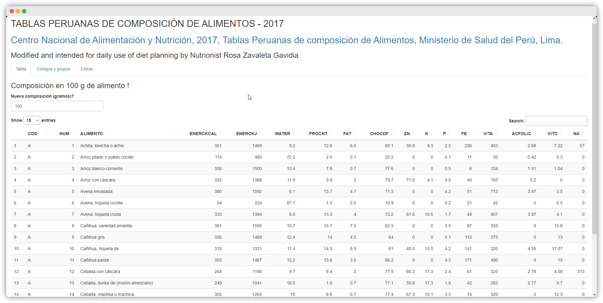

```{r, echo=FALSE}
setwd("D:/Developments/ParaGitHub/SergioWeb/SergioWeb/Blogs3/b_1")
```

[{fig-align="center"}](https://sergiojacobozavaleta.shinyapps.io/rosaapp/)

# A quien va dirigido?

A todas los profesionales en nutrición que desean planificar o programar sus dietas nutricionales en base a la composición nutricional de diversos alimentos en la cocina peruana según la cantidad deseada.

# Implementación

> Versión 1 ✅:
>
> -   Es posible calcular cualquier composición en base a la cantidad ingresada por el usuario en gramos.
>
> -   Solo se incluyeron alimentos individuales y no compuestos.

## Código

```{r}
#| eval: false

#setwd("Ruta/a/tu/proyecto/") # Comentar antes de renderizar la aplicación

library(shiny)
library(DT) # Manejo de tablas en formato Data Frame

alimentos = read.csv("alimentos.csv") # <1>
colnames(alimentos) = c("COD","NUM","ALIMENTO","ENERCKCAL","ENERCKJ","WATER","PROCNT","FAT","CHOCDF","ZN","K","P","FE","VITA","ACFOLIC","VITC","NA") # <1>
alimentos = alimentos[,c("COD","NUM", "ALIMENTO", "ENERCKCAL", "ENERCKJ", "WATER", "PROCNT", "FAT", "CHOCDF","ZN","K","P","FE","VITA","ACFOLIC","VITC","NA")] # <1>

codigo = c("A","B", "C", "D", "E", "F", "G", "H", "J", "K", "L", "Q", "T", "U", "S") # <2>
categoria = c("Cereales y derivados", "Verduras, hortalizas y derivados", "Frutas y derivados", "Grasas, aceites y oleaginosas","Pescados y mariscos", "Carnes y derivados", "Leche y derivados", "Bebidas (alcohólicas y analcohólicas)", "Huevos y derivados","Productos azucarados", "Misceláneos", "Alimentos infantiles", "Leguminosas y derivados", "Tubérculos, raíces y derivados","Alimentos preparados")# <2>
codigoGrupo = data.frame(codigo,categoria) # <2>
colnames(codigoGrupo) = c("Código", "Categoría") # <2>

ui <- fluidPage( # <3>
  titlePanel("TABLAS PERUANAS DE COMPOSICIÓN DE ALIMENTOS - 2017"),# <3>
  h2(tags$a("Centro Nacional de Alimentación y Nutrición, 2017, Tablas Peruanas de composición de Alimentos, Ministerio de Salud del Perú, Lima.",href="https://web.ins.gob.pe/es/alimentacion-y-nutricion/ciencia-y-tecnologia-de-alimentos/tabla-de-composicion-de-alimentos")),# <3>
  h3("Modified and intended for daily use of diet planning by Nutrionist Rosa Zavaleta Gavidia"),# <3>
  tabsetPanel(# <3>
    tabPanel("Tabla",# <3>
      h3("Composición en 100 g de alimento !"),# <3>
      numericInput("proportion","Nueva composición (gramos)?", value=100, min=1, max=500),# <3>
      DT::dataTableOutput('foodTable'),# <3>
      verbatimTextOutput("dataConversion")# <3>
    ),
    tabPanel("Códigos y grupos", tableOutput('codigoGrupos')),# <3>
    tabPanel("Extras")# <3>
  ),
  hr(),# <3>
  tags$div(class = "header", checked=NA,# <3>
           tags$h5("App built with R Shiny. Did you like it? If so"),# <3>
           tags$a(href = "shiny.rstudio.com/tutorial", "Click Here to learn more!")# <3>
  )
)

server <- function(input, output, session) {# <4>
  getComposition <- reactive({# <5>
    proportionConversion = input$proportion# <5>
    idx = input$foodTable_rows_selected# <5>
    alimentos[idx,c("PROCNT", "FAT","CHOCDF","ZN","K","P","FE","VITA","ACFOLIC","VITC","NA")]*proportionConversion/100})# <5>
  
  output$foodTable = DT::renderDataTable(alimentos, options = list(pageLength=15),server=FALSE, selection="single")# <6>
  output$dataConversion = renderPrint({getComposition()})# <7>
  output$codigoGrupos = renderTable(codigoGrupo)# <8>
}

shinyApp(ui, server)# <9>
```

1. Cargar `alimentos.csv`, seleccionar datos requeridos y modificar sus atributos (nombre de columnas)
2. Crear tabla secundaria de alimentos según código por grupo nutricional (*Opcional*)
3. Implementar la interfaz de usuario de la aplicación Shiny llamando a  `fluidPage`. Incluido una entrada de texto para la nueva composición deseada.
4. Implementar la función `server` que define la lógica del programa
5. Definir la función para manipular la fila seleccionada de la tabla principal (*composición de alimento deseada*)
6. Renderizar la tabla principal de alimentos
7. Renderizar los datos de salida para la nueva composición
8. Renderizar la tabla secundaria para códigos por grupo de tipo alimento
9. Implementar la aplicación llamando a `shinyApp`

## Uso

[Ir a la Aplicación ⏩](https://sergiojacobozavaleta.shinyapps.io/rosaapp/)

::: callout-tip
## Más allá de esta guía

Revisar la página oficial para obtener las [Tablas de Composición  completas](https://web.ins.gob.pe/es/alimentacion-y-nutricion/ciencia-y-tecnologia-de-alimentos/tabla-de-composicion-de-alimentos)
:::

